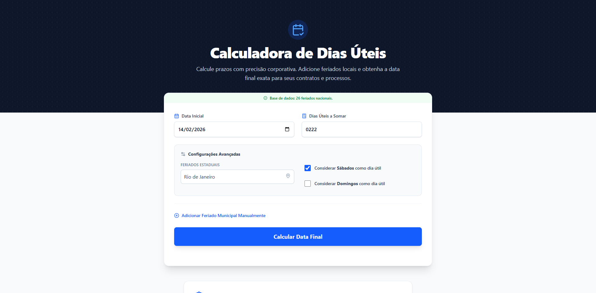
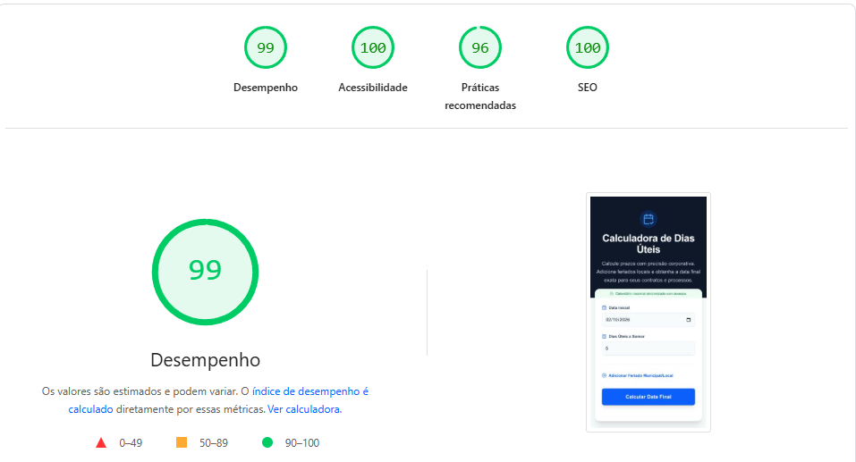

# 🇧🇷 Brazilian Business Days Calculator



<div align="center">

[](https://nextjs.org/)
[](https://www.typescriptlang.org/)
[](https://tailwindcss.com/)
[](https://vitest.dev/)
[](LICENSE)

</div>

<p align="center">
  <strong>A high-precision Micro-SaaS for calculating working days, considering national holidays, state legislations, and custom dates.</strong>
</p>

---

## 🚀 Overview

This project is a modern web application designed to solve a common bureaucratic problem in Brazil: calculating legal deadlines accurately.

Unlike simple date counters, this tool integrates with **Government APIs** to fetch real-time holiday data, while implementing a robust **Fallback Strategy** to ensure 100% uptime even if external services fail.

### ✨ Key Features

- **🎯 Precision Calculation:** Algorithms that automatically exclude weekends and holidays.
- **🌎 Regional Intelligence:** Database of state-specific holidays (e.g., _São Paulo_ vs. _Rio de Janeiro_).
- **⚡ High Performance:** Achieved **99/100** Performance score on Google Lighthouse (Mobile).
- **🎨 Modern UI:** Built with Tailwind CSS concepts for accessibility and responsiveness.
- **⚙️ Configurable:** Users can toggle saturday workdays and add manual custom holidays.

---

## 🏗️ Tech Stack & Engineering Decisions

This project was built simulating a real-world production environment, focusing on scalability, maintainability, and DX (Developer Experience).

| Category       | Technology              | Reasoning                                                                |
| -------------- | ----------------------- | ------------------------------------------------------------------------ |
| **Framework**  | Next.js 14 (App Router) | Leverages React Server Components (RSC) for better initial load and SEO. |
| **Language**   | TypeScript              | Ensures type safety and reduces runtime errors.                          |
| **Styling**    | Tailwind CSS            | Utility-first approach for rapid UI development and low bundle size.     |
| **Date Logic** | date-fns                | Lightweight and immutable date manipulation library.                     |
| **Testing**    | Vitest                  | Faster unit testing compared to Jest, with native ESM support.           |
| **CI/CD**      | GitHub Actions          | Automated pipeline for linting, building, and testing on every push.     |
| **Quality**    | ESLint + Prettier       | Enforces code standards                                                  |

---

## 🏆 Performance & Quality

The application is optimized for Core Web Vitals.



- **SEO:** Implemented JSON-LD structured data and semantic HTML.
- **Hydration:** Optimized to prevent layout shifts (CLS).
- **Accessibility:** ARIA labels and keyboard navigation support.

---

## 🧪 Testing Strategy

The logic core is fully covered by unit tests to ensure legal accuracy.

```bash
# Run unit tests
npm test

# Run tests with UI interface
npm run test:ui
```

## 💻 Getting Started

### Prerequisites

- Node.js 18+
- npm or yarn

### Installation

1. Clone the repository:

```bash
git clone [https://github.com/leandrakelly/business-days-calculator.git](https://github.com/leandrakelly/business-days-calculator.git)
```

2. Install dependencies:

```bash
npm install
```

3. Run the development server:

```bash
npm run dev
```

4. Open [http://localhost:3000](https://www.google.com/search?q=http://localhost:3000) in your browser.

_This project is open-source and available under the MIT License._
